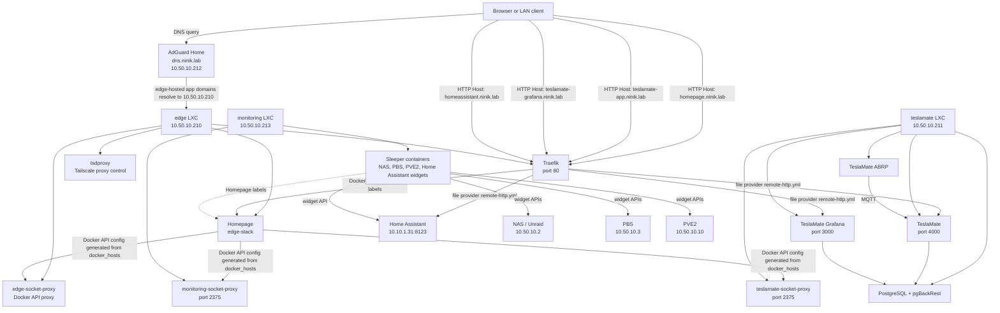

# Ansible Architecture

This document describes the Ansible layer in this repository: inventory, roles, service stacks, routing, DNS, Homepage discovery, and the main design decisions.

## Scope

Ansible owns ongoing host configuration and Docker-based service deployment after Terraform has created the machines. Terraform owns the lifecycle of VMs/LXCs and network identity; Ansible assumes the host exists and is reachable over SSH.

The active entry points are:

- Inventory: `ansible/hosts.ini`
- Playbook: `ansible/run.yaml`
- Configuration: `ansible/ansible.cfg`
- Host/group variables: `ansible/group_vars/`
- Reusable roles: `ansible/roles/`
- Vendored Galaxy roles: `ansible/galaxy_roles/`
- Compose stack source files: `ansible/services/`
- Operator shortcuts: `justfile`

## Deployment Model

Each Docker service host is represented as an Ansible inventory group. The group name also selects its service stack through `compose_stack_name`.

| Inventory group | Hostname | IP | Main purpose |
| --- | --- | --- | --- |
| `edge` | `edge.ninik.lab` | `10.50.10.210` | Traefik, Homepage, tsdproxy |
| `dns` | `dns.ninik.lab` | `10.50.10.212` | AdGuard Home and DNS rewrites |
| `monitoring` | `monitoring.ninik.lab` | `10.50.10.213` | Homepage widget sleeper containers |
| `teslamate` | `teslamate.ninik.lab` | `10.50.10.211` | TeslaMate, Grafana, PostgreSQL, ABRP |
| `aiml` | `aiml.ninik.lab` | `10.50.10.214` | Immich and NVIDIA-backed ML services |
| `pve2` | `pve2` | `10.50.10.10` | Proxmox host package management |
| `pbs` | `pbs` | `10.50.10.3` | Proxmox Backup Server package management |

The common execution pattern is:

```bash
just run edge
just run dns
just run monitoring
just run teslamate
```

For secret-backed runs, the `justfile` wraps many commands in `doppler run -p ninik-lab -c prd`.

## High-Level Drawing



## Playbook Flow

`ansible/run.yaml` is the central playbook. It applies a small set of roles to each inventory group:

- `packages`: installs common packages from `common_packages`.
- `geerlingguy.docker`: installs and manages Docker and the Compose plugin.
- `compose_stack`: deploys the service stack for the current host group.
- `dns_host_prepare`: prepares the DNS host so AdGuard can bind port 53.
- `adguard_config`: bootstraps AdGuard and manages DNS rewrites through the AdGuard API.

The `edge`, `dns`, `monitoring`, and `teslamate` groups all use `compose_stack`. The stack deployed is determined by host group variables:

```yaml
compose_stack_name: edge
compose_stack_project_name: edge
compose_stack_dest_dir: /opt/edge
```

The role then reads from:

```text
ansible/services/<compose_stack_name>/
```

and deploys to:

```text
<compose_stack_dest_dir>/
```

## Compose Stack Role

`roles/compose_stack` is the deployment primitive for Docker services.

It performs this sequence:

1. Validates that the stack variables are set.
2. Checks whether `services/<stack>/files` and/or `services/<stack>/templates` exist.
3. Removes the currently deployed Compose project if a compose file already exists.
4. Creates the destination directories declared in `compose_stack_directories`.
5. Creates custom-owned directories declared in `compose_stack_directory_specs`.
6. Copies static files from `services/<stack>/files`.
7. Renders templates from `services/<stack>/templates`, preserving relative paths and removing `.j2`.
8. Renders secret files from `compose_stack_secret_files`.
9. Runs `community.docker.docker_compose_v2` with `state: present`, `recreate: always`, and `remove_orphans: true`.

Design implication: every Ansible run recreates the Compose stack. This favors convergence and removes stale containers, but it can cause service restarts even for small config changes.

## Services

### Edge

Source:

```text
ansible/services/edge/
```

Destination:

```text
/opt/edge
```

Containers:

- `traefik`: LAN HTTP reverse proxy on port 80.
- `homepage`: service dashboard.
- `tsdproxy`: Tailscale Docker proxy automation.
- `edge-socket-proxy`: restricted Docker socket proxy for local Docker metadata.

Traefik has two providers:

- Docker provider: reads labels from the local edge Docker daemon only.
- File provider: reads generated dynamic config from `/etc/traefik/dynamic`.

This is why remote services such as TeslaMate and Home Assistant are represented in `remote_http_services`; edge Traefik cannot discover labels from remote Docker daemons through the local Docker provider.

Generated edge config:

- `homepage/config/docker.yaml`: generated from `docker_hosts`.
- `tsdproxy/config/tsdproxy.yaml`: generated from `docker_hosts`.
- `traefik/dynamic/remote-http.yml`: generated from `remote_http_services`.
- `.env`: includes config hashes used as labels to force Compose recreation when config content changes.

### DNS

Source:

```text
ansible/services/dns/
```

Destination:

```text
/opt/dns
```

Containers:

- `adguard`: AdGuard Home on DNS ports 53 TCP/UDP and web ports 80/3000.
- `edge-socket-proxy`: restricted Docker socket proxy so Homepage can discover AdGuard labels.

`dns_host_prepare` disables `systemd-resolved` and writes `/etc/resolv.conf` so AdGuard can bind port 53.

`adguard_config` then:

- bootstraps AdGuard first-run configuration when needed;
- waits for the authenticated API;
- removes managed DNS rewrites whose answers are stale;
- adds missing rewrites from `dns_rewrite_entries`.

### Monitoring

Source:

```text
ansible/services/monitoring/
```

Destination:

```text
/opt/monitoring
```

Containers:

- `unraid-sleeper-host`
- `pbs-sleeper-host`
- `pve2-sleeper-host`
- `homeassistant-sleeper-host`
- `monitoring-socket-proxy`

The sleeper containers do not provide applications. They exist so Homepage can discover labels through Docker and render widgets for external systems such as Unraid, PBS, PVE2, and Home Assistant.

### TeslaMate

Source:

```text
ansible/services/teslamate/
```

Destination:

```text
/opt/teslamate
```

Containers:

- `teslamate-postgres`: custom PostgreSQL image with pgBackRest backup loop.
- `teslamate-teslamate`: TeslaMate app on port 4000.
- `teslamate-grafana`: Grafana on port 3000.
- `teslamate-abrp`: ABRP integration.
- `teslamate-socket-proxy`: restricted Docker socket proxy for Homepage discovery.

The TeslaMate app hostname is intentionally separate from the node hostname:

- `teslamate.ninik.lab`: node identity, resolves to `10.50.10.211`.
- `teslamate-app.ninik.lab`: application route, resolves to edge and is proxied to `10.50.10.211:4000`.
- `teslamate-grafana.ninik.lab`: application route, resolves to edge and is proxied to `10.50.10.211:3000`.

TeslaMate maintenance helpers are deployed to:

```text
/opt/teslamate/bin/
```

The helper scripts follow TeslaMate's documented logical backup/restore flow using `pg_dump` and `psql`, adapted to this stack's service names and environment variables.

Create a backup:

```bash
ssh root@teslamate.ninik.lab
/opt/teslamate/bin/teslamate-backup
```

The default backup path is:

```text
/opt/teslamate/backups/teslamate_YYYYMMDD-HHMM.bck
```

Copy backups to off-host storage after creation.

Restore a backup:

```bash
ssh root@teslamate.ninik.lab
/opt/teslamate/bin/teslamate-restore /opt/teslamate/backups/teslamate_YYYYMMDD-HHMM.bck
```

The restore helper stops TeslaMate application containers, drops and recreates the expected schemas/extensions, imports the backup, and starts the application containers again. It supports plain `.bck` files and gzip-compressed `.gz` files.

The TeslaMate `TESLAMATE_ENCRYPTION_KEY` must match the original installation that created the backup.

## DNS And Routing

DNS rewrites live in `ansible/group_vars/dns.yml`.

There are two classes of names:

1. Node names, which resolve directly to the node.
2. Application names, which resolve to edge and are routed by Traefik.

Examples:

| Domain | Resolves to | Reason |
| --- | --- | --- |
| `teslamate.ninik.lab` | `IP_TESLAMATE` | Node identity |
| `teslamate-app.ninik.lab` | `IP_EDGE` | App through edge Traefik |
| `teslamate-grafana.ninik.lab` | `IP_EDGE` | App through edge Traefik |
| `homeassistant.ninik.lab` | `IP_EDGE` | App through edge Traefik |
| `homepage.ninik.lab` | `IP_EDGE` | Local edge app |
| `traefik.ninik.lab` | `IP_EDGE` | Local edge dashboard |
| `dns.ninik.lab` | `IP_DNS` | DNS host and AdGuard |

Traefik routing is split the same way:

- Edge-local containers use Docker labels.
- Remote HTTP backends use `remote_http_services`.

`remote_http_services` entries have this meaning:

```yaml
- name: homeassistant
  host: "{{ IP_HOMEASSISTANT }}"
  port: 8123
  domain: homeassistant.ninik.lab
```

The generated Traefik route is:

```text
Host(`homeassistant.ninik.lab`) -> http://10.10.1.31:8123
```

`domain` is what the client asks for. `host` and `port` are where Traefik sends the request.

## Homepage Discovery

Homepage uses a generated Docker provider config at:

```text
/opt/edge/homepage/config/docker.yaml
```

The source template is:

```text
ansible/services/edge/templates/homepage/config/docker.yaml.j2
```

It includes:

- the local edge socket proxy;
- each remote Docker endpoint in `docker_hosts`.

Current `docker_hosts` entries cover:

- DNS
- Monitoring
- TeslaMate
- NAS

Each remote host must expose a socket proxy on port 2375 for Homepage discovery to work. A service only appears in Homepage if it has the appropriate `homepage.*` Docker labels and Homepage can reach that host's socket proxy.

## Docker Socket Proxies

The Docker socket proxies expose a restricted HTTP view of Docker. They avoid mounting every remote Docker socket into edge directly.

Common permissions:

- `CONTAINERS=1`
- `EVENTS=1`
- `INFO=1`
- `NETWORKS=1`
- `PING=1`
- `VERSION=1`
- `POST=0`

Design implication: these proxies are intended for discovery and metadata, not remote Docker administration.

## Secrets And Environment

Most secrets are read from environment variables with Ansible lookups. The expected runtime is Doppler:

```bash
doppler run -p ninik-lab -c prd -- just run edge
```

Important secret-backed values include:

- AdGuard credentials.
- Tailscale auth key for `tsdproxy`.
- TeslaMate encryption key, database password, Grafana credentials, ABRP key, and MQTT credentials.
- API credentials/tokens for Homepage widgets.

Rendered `.env` files are generally mode `0640`. Secret files are rendered with stricter defaults through `compose_stack_secret_files`.

## Design Decisions

### Keep Terraform And Ansible Boundaries Separate

Terraform creates hosts and network identity. Ansible configures packages, Docker, services, DNS application state, and generated service config. This keeps host lifecycle changes separate from day-to-day service changes.

### One Compose Stack Per Service Host

Each main service node has one Compose project rooted under `/opt/<stack>`. This makes deployment predictable and keeps local state beside its Compose source.

### Use A Generic Compose Deployment Role

The `compose_stack` role prevents every service from needing its own copy/render/deploy logic. Service-specific behavior is expressed through group vars and the `services/<name>` folder.

### Prefer Static Inventory For The Lab

The current Ansible inventory is static. This is simple and explicit for the lab, but Terraform output generation can replace it later if host counts or identities become more dynamic.

### Centralize LAN HTTP Entry Through Edge

User-facing app domains usually resolve to edge and route through Traefik. This gives one place for HTTP routing, dashboards, access logs, and future TLS or middleware.

### Do Not Use Traefik Docker Labels Across Hosts

Traefik's Docker provider watches one Docker endpoint. The edge Traefik instance watches the local edge Docker socket only. Remote services are routed through the Traefik file provider using generated config from `remote_http_services`.

### Separate Node DNS From App DNS

Node names such as `teslamate.ninik.lab` identify hosts. App names such as `teslamate-app.ninik.lab` identify user-facing services. This avoids collisions where a hostname is needed both for SSH and for reverse-proxied HTTP.

### Use Sleeper Containers For External Homepage Widgets

Some Homepage widgets represent external systems that are not Docker containers on the monitoring node. Sleeper containers provide a stable Docker-label anchor so Homepage can discover and render those widgets.

### Use Docker Socket Proxies Instead Of Raw Remote Sockets

Remote Docker metadata is exposed through `tecnativa/docker-socket-proxy` with read-oriented permissions and `POST=0`. This reduces the blast radius compared with exposing full Docker sockets.

### Drive Recreates With Config Hash Labels

The edge stack places config hashes in labels such as `edge.stack.homepage-config-sha`. When rendered config changes, the Compose input changes and containers are recreated with the new configuration.

## Operational Commands

Install/update Galaxy roles:

```bash
just repo
```

Run one host:

```bash
just run edge
just run dns
just run monitoring
just run teslamate
```

Deploy DNS rewrites only:

```bash
just dns
```

Run DNS and edge together:

```bash
just core
```

Run Compose-related playbook work directly:

```bash
just compose edge
```

Syntax check:

```bash
cd ansible
ANSIBLE_LOCAL_TEMP=/tmp/ansible-local ansible-playbook --syntax-check run.yaml
```

## Debugging Paths

### DNS

Check where a name resolves:

```bash
dig +short homeassistant.ninik.lab
dig +short teslamate-app.ninik.lab
```

Expected edge-routed app names should resolve to `10.50.10.210`.

### Traefik

On the edge host:

```bash
cd /opt/edge
docker compose logs traefik --tail=200
curl -s http://127.0.0.1/api/http/routers
curl -s http://127.0.0.1/api/http/services
curl -I -H 'Host: homeassistant.ninik.lab' http://127.0.0.1
```

If a remote route is missing, inspect:

```bash
/opt/edge/traefik/dynamic/remote-http.yml
```

### Homepage

Check the generated Docker provider config:

```bash
cat /opt/edge/homepage/config/docker.yaml
```

Then verify the relevant remote socket proxy:

```bash
curl http://10.50.10.213:2375/version
curl http://10.50.10.211:2375/version
```

If a service is absent from Homepage, check that the container has `homepage.*` labels and that its host is present in `docker_hosts`.

### Remote Backends

From edge, verify Traefik can reach the backend directly:

```bash
curl -I http://10.50.10.211:4000
curl -I http://10.50.10.211:3000
curl -I http://10.10.1.31:8123
```

For Home Assistant behind Traefik, Home Assistant may also need trusted proxy configuration:

```yaml
http:
  use_x_forwarded_for: true
  trusted_proxies:
    - 10.50.10.210
```

## Current Sharp Edges

- `compose_stack` removes and recreates existing stacks on each run. This keeps orphans under control but restarts services.
- Remote Traefik routes are explicit. Adding a remote app requires both DNS and `remote_http_services`.
- Homepage remote discovery depends on socket proxies being reachable on port 2375.
- The DNS template file is named `rewrittes.txt.j2`; the authoritative DNS rewrite source is still `dns_rewrite_entries` plus the `adguard_config` role.
- Secrets are environment-driven. Running Ansible outside Doppler requires manually exporting the same variables.
