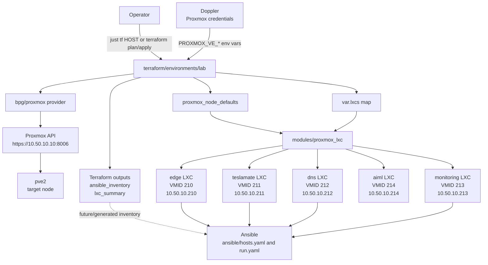

# Terraform Architecture

This document describes the Terraform layer in this repository: environments, modules, Proxmox resources, variables, outputs, and design decisions.

## Scope

Terraform owns infrastructure lifecycle for the lab. It creates Proxmox LXCs, assigns VM IDs, configures container CPU/memory/disk/network settings, injects SSH keys, and exposes outputs that can be used by Ansible.

Ansible takes over after a host exists. Terraform does not install Docker, deploy services, configure AdGuard rewrites, or manage application configuration.

The active entry points are:

- Lab environment: `terraform/environments/lab/`
- LXC module: `terraform/modules/proxmox_lxc/`
- VM placeholder module: `terraform/modules/proxmox_vm/`
- Cloud-init templates: `terraform/templates/cloud-init/`
- Operator shortcuts: `justfile`

## High-Level Drawing



## Repository Layout

```text
terraform/
  environments/
    lab/
      main.tf
      variables.tf
      terraform.tfvars
      outputs.tf
      versions.tf
  modules/
    proxmox_lxc/
      main.tf
    proxmox_vm/
      main.tf
  templates/
    cloud-init/
      user-data.yaml.tftpl
      network-config.yaml.tftpl
```

`terraform/environments/lab` is the active environment. It instantiates one `proxmox_lxc` module per entry in `var.lxcs`.

## Lab Environment

The lab environment uses the `bpg/proxmox` provider. The provider endpoint is derived from `proxmox_api_url` by removing a trailing `/api2/json` if present:

```hcl
locals {
  proxmox_endpoint = trimsuffix(var.proxmox_api_url, "/api2/json")
}
```

Current non-secret settings live in `terraform/environments/lab/terraform.tfvars`.

Important environment-level values:

| Setting | Current value | Purpose |
| --- | --- | --- |
| `environment` | `lab` | Environment label used in descriptions |
| `default_user` | `root` | User emitted into generated Ansible inventory output |
| `proxmox_api_url` | `https://10.50.10.10:8006` | Proxmox API endpoint |
| `proxmox_insecure_tls` | `true` | Allows self-signed Proxmox TLS |
| `target_node` | `pve2` per LXC | Proxmox node where containers are created |
| `bridge` | `vmbr0` | Network bridge for container `eth0` |
| `gateway` | `10.50.10.1` | Default LXC gateway |
| `nameserver` | `10.50.10.212` | Default DNS server for most containers |
| `search_domain` | `ninik.lab` | DNS search domain |

The DNS LXC overrides `nameserver` to `10.50.10.1` to avoid depending on itself during bootstrap.

## Provisioned LXCs

The active LXC map currently defines:

| Key | Name | VMID | IP | Target node | Root disk | Ansible group |
| --- | --- | --- | --- | --- | --- | --- |
| `edge` | `edge` | `210` | `10.50.10.210` | `pve2` | `8G` | `edge` |
| `teslamate` | `teslamate` | `211` | `10.50.10.211` | `pve2` | `16G` | `teslamate` |
| `dns` | `dns` | `212` | `10.50.10.212` | `pve2` | `16G` | `dns` |
| `monitoring` | `monitoring` | `213` | `10.50.10.213` | `pve2` | `16G` | `monitoring` |
| `aiml` | `aiml` | `214` | `10.50.10.214` | `pve2` | `64G` | `aiml` |
| `nextcloud` | `nextcloud` | `215` | `10.50.10.215` | `pve2` | `32G` | `nextcloud` |

Unless overridden, LXCs use:

- Ubuntu 24.04 LXC template: `ubuntu-24.04-standard_24.04-2_amd64.tar.zst`
- `rootfs_storage`: `local-lvm`
- `ostemplate_storage`: `local`
- `cores`: `2`
- `memory_mb`: `2048`
- `swap_mb`: `512`
- `start_on_boot`: `true`
- `unprivileged`: `true`
- `nesting`: `true`
- `keyctl`: `true`
- `fuse`: `true`

Nesting, keyctl, and fuse are enabled because these LXCs are intended to run Docker after Ansible configures them.

The `aiml` LXC also manages raw NVIDIA passthrough lines in `/etc/pve/lxc/214.conf` for cgroup device access and `/dev/nvidia*` bind mounts.

## LXC Module

`terraform/modules/proxmox_lxc/main.tf` wraps `proxmox_virtual_environment_container`.

It manages:

- Proxmox node placement and VMID.
- Description, tags, start-on-boot, protection, and privilege mode.
- Container features: nesting, keyctl, fuse.
- CPU cores.
- Dedicated memory and swap.
- Root disk datastore and size.
- Optional mount points.
- Hostname.
- Static IPv4 address, CIDR prefix, and gateway.
- DNS domain and nameserver.
- SSH public keys for the root/default user account.
- Network interface bridge and optional VLAN ID.
- LXC OS template.

The module outputs:

- `name`
- `vm_id`
- `target_node`
- `description`
- `tags`

## Inputs And Defaults

The environment defines two important input layers:

1. `proxmox_node_defaults`: shared defaults for all LXCs.
2. `lxcs`: per-container overrides.

The environment passes values into the module with `coalesce` and null checks. Per-LXC values win; otherwise shared defaults are used.

Example:

```hcl
gateway = each.value.gateway != null ? each.value.gateway : var.proxmox_node_defaults.gateway
bridge  = coalesce(each.value.bridge, var.proxmox_node_defaults.bridge, "vmbr0")
```

This lets most containers stay small in `terraform.tfvars`, while special cases such as DNS bootstrap can override individual settings.

## Outputs

The lab environment exposes two outputs.

`lxc_summary`:

```hcl
{
  edge = {
    name        = "edge"
    vm_id       = 210
    target_node = "pve2"
  }
}
```

`ansible_inventory`:

```hcl
{
  all = {
    children = {
      edge = {
        hosts = {
          edge = {
            ansible_host = "10.50.10.210"
            ansible_user = "root"
          }
        }
      }
    }
  }
}
```

The generated inventory output is not currently the active inventory. The active Ansible inventory is still `ansible/hosts.yaml`.

## Authentication And Secrets

Provider credentials are intentionally not stored in `terraform.tfvars`.

Expected environment variables:

- `PROXMOX_VE_API_TOKEN`

or:

- `PROXMOX_VE_USERNAME`
- `PROXMOX_VE_PASSWORD`

Optional:

- `PROXMOX_VE_INSECURE=true`

The `justfile` runs Terraform through Doppler:

```bash
doppler run -p ninik-lab -c prd -- terraform -chdir=terraform/environments/lab plan
```

## Operational Commands

Initialize providers:

```bash
terraform -chdir=terraform/environments/lab init
```

Format:

```bash
terraform -chdir=terraform/environments/lab fmt -recursive
```

Validate:

```bash
terraform -chdir=terraform/environments/lab validate
```

Plan the full lab:

```bash
doppler run -p ninik-lab -c prd -- terraform -chdir=terraform/environments/lab plan
```

Apply the full lab:

```bash
doppler run -p ninik-lab -c prd -- terraform -chdir=terraform/environments/lab apply
```

Target one LXC through the `justfile`:

```bash
just tf edge
```

That shortcut currently runs destroy, plan, and apply for:

```text
module.lxc["edge"]
```

Use targeted operations carefully. They are useful for rebuilding one lab LXC, but full plans are better for understanding environment-wide drift.

## Terraform To Ansible Handoff

Terraform and Ansible are connected by convention today:

- Terraform creates the LXC with a known name and IP.
- `ansible/hosts.yaml` contains the same hostname and IP.
- Ansible group names match `ansible_groups` in each Terraform LXC definition.

Example:

```hcl
lxcs = {
  edge = {
    name           = "edge"
    ip_address     = "10.50.10.210"
    ansible_groups = ["edge"]
  }
}
```

matching:

```ini
[edge]
edge.ninik.lab ansible_host=10.50.10.210 ansible_ssh_user=root
```

The `ansible_inventory` output is the natural next step if static inventory becomes painful.

## Cloud-Init And VM Module Status

`terraform/modules/proxmox_vm` currently defines only variables and pass-through outputs. It does not create a Proxmox VM resource yet.

The cloud-init templates are also present but not wired into the active lab environment:

- `templates/cloud-init/user-data.yaml.tftpl`
- `templates/cloud-init/network-config.yaml.tftpl`

They define a likely future VM bootstrap path:

- hostname and FQDN;
- timezone;
- admin user with passwordless sudo;
- SSH authorized keys;
- `qemu-guest-agent`, `curl`, and `ca-certificates`;
- static network config.

Current active provisioning is LXC-only.

## Design Decisions

### Keep Terraform Focused On Host Lifecycle

Terraform creates and sizes Proxmox containers. It does not install application packages or deploy Compose stacks. This avoids mixing infrastructure lifecycle with mutable service configuration.

### Use A Map Of LXCs

`var.lxcs` allows the lab to add or remove containers without duplicating module blocks. Each key becomes one `module.lxc` instance.

### Use Shared Defaults With Per-Host Overrides

Most LXC settings are identical across the lab. `proxmox_node_defaults` keeps the shared policy in one place while still allowing overrides for hosts such as DNS.

### Use Stable VMIDs And Static IPs

The lab uses predictable VMIDs and IP addresses. This makes DNS, Ansible inventory, and Proxmox operations easier to reason about.

### Enable Docker-Friendly LXC Features By Default

Nesting, keyctl, and fuse are enabled by default because the managed LXCs run Docker via Ansible.

### Keep Secrets Out Of tfvars

Proxmox credentials come from environment variables, usually injected by Doppler. `terraform.tfvars` stores only non-secret lab configuration.

### Generate Inventory Shape But Keep Static Inventory Active

The lab environment already computes `ansible_inventory`, but does not write it to the Ansible tree. This documents the intended integration point without forcing inventory generation before it is needed.

### Keep VM Support As Scaffolded Future Work

The VM module and cloud-init templates are present, but inactive. This preserves a direction for VM provisioning without complicating the current LXC workflow.

## Debugging

Check Terraform's view of current LXC outputs:

```bash
terraform -chdir=terraform/environments/lab output lxc_summary
terraform -chdir=terraform/environments/lab output ansible_inventory
```

Check one container in state:

```bash
terraform -chdir=terraform/environments/lab state show 'module.lxc["edge"].proxmox_virtual_environment_container.this'
```

Check plan for one target:

```bash
doppler run -p ninik-lab -c prd -- terraform -chdir=terraform/environments/lab plan -target='module.lxc["edge"]'
```

Common things to verify when a new LXC does not behave as expected:

- The VMID is unique in Proxmox.
- The LXC template exists in `local:vztmpl`.
- The rootfs datastore exists.
- The bridge and VLAN are valid on the target node.
- The IP does not conflict with another host.
- The SSH public key is present and correct.
- The Ansible inventory was updated to match the Terraform IP.

## Current Sharp Edges

- Terraform state files are present under `terraform/environments/lab`; be careful not to commit sensitive drift or provider-derived values.
- The generated Ansible inventory is an output only; it does not update `ansible/hosts.yaml`.
- `just tf HOST` performs a targeted destroy before targeted plan/apply.
- The VM module is not an active provisioning module yet.
- `terraform validate` depends on a working local Proxmox provider plugin.
